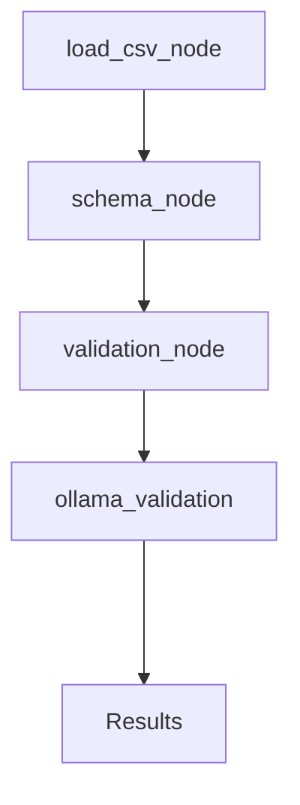

# AutoValidate AI — Multi-Step CSV Validation with LangGraph #


### Built an autonomous AI agent using LangGraph that validates CSV data against PostgreSQL database schemas to ensure data accuracy, consistency, and compliance before ingestion. The agent performs intelligent schema mapping, datatype validation, null checks, constraint verification, and error reporting through a multi-step workflow. Designed to automate data quality checks, reduce manual validation effort, and improve reliability in ETL/data pipeline processes.###


# WorkFlow #


## TechStacks ##
+ LangGraph
+ Langchain
+ Postgres Sql
+ Ollama model (qwen3:8b)


### Ollama Commands Used in Localhost ###
```
> pip install langchain-ollama 
> ollama pull qwen3:8b
```

### Langchain Commands Used in Localhost ###
```
> pip install langchain
```
## Postgres Schema ##

